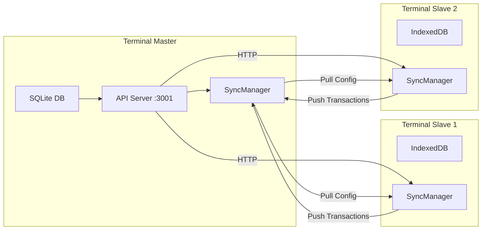
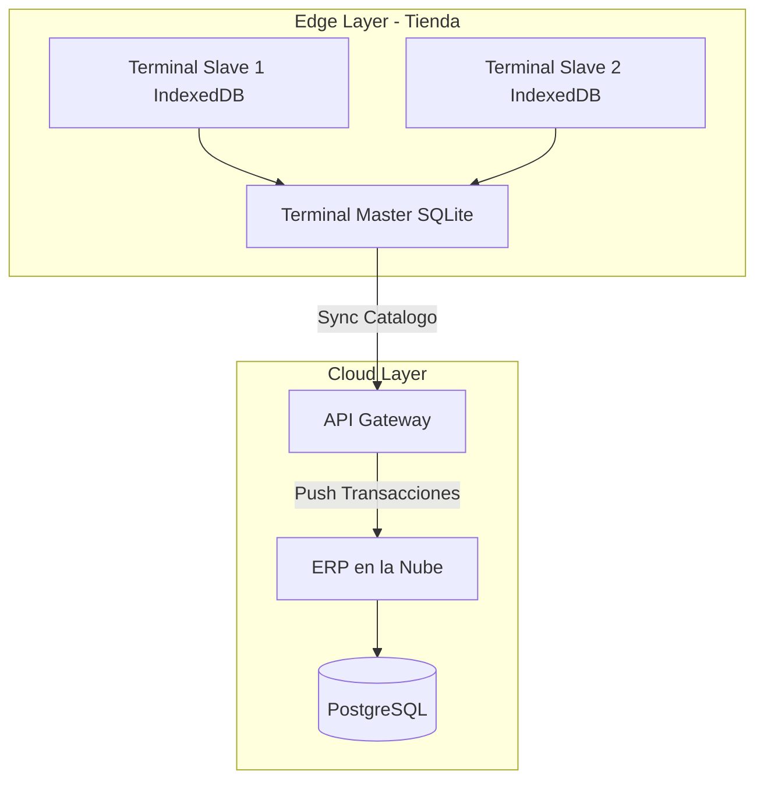

# Diagramas de Arquitectura (Mermaid)

## 5.1 Arquitectura de Sincronizacion

```mermaid
flowchart LR
  subgraph TM["Terminal Master"]
    TMDB["SQLite DB"] --> TMAPI["API Server :3001"] --> TMSM["SyncManager"]
  end

  subgraph TS1["Terminal Slave 1"]
    TS1DB["IndexedDB"]
    TS1SM["SyncManager"]
  end

  subgraph TS2["Terminal Slave 2"]
    TS2DB["IndexedDB"]
    TS2SM["SyncManager"]
  end

  TMAPI -- "HTTP" --> TS1SM
  TMAPI -- "HTTP" --> TS2SM

  TS1SM -- "Push Transactions" --> TMSM
  TS2SM -- "Push Transactions" --> TMSM

  TMSM -- "Pull Config" --> TS1SM
  TMSM -- "Pull Config" --> TS2SM
```

## 6.1 Arquitectura Objetivo (Cloud-Ready)

```mermaid
flowchart TB
  subgraph EDGE["Edge Layer - Tienda"]
    ES1["Terminal Slave 1 IndexedDB"]
    ES2["Terminal Slave 2 IndexedDB"]
    EM["Terminal Master SQLite"]
    ES1 --> EM
    ES2 --> EM
  end

  EM -- "Sync Catalogo" --> API

  subgraph CLOUD["Cloud Layer"]
    API["API Gateway"]
    ERP["ERP en la Nube"]
    PG[("PostgreSQL")]
    API -- "Push Transacciones" --> ERP
    ERP --> PG
  end
```
